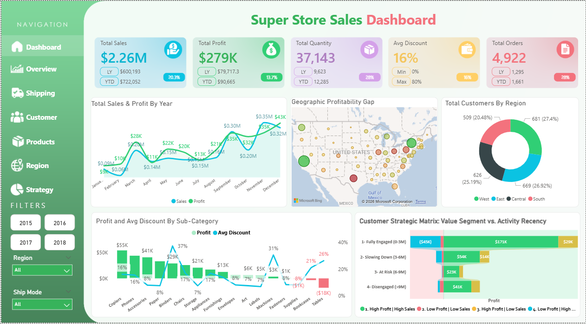

#  SuperStore Sales Analysis

##  Project Overview

This project analyzes retail sales data (2015–2018) to identify profitability drivers, discount impact, and regional performance gaps using interactive Power BI dashboards.

The goal is to transform raw data into actionable insights that support better business decision-making.

---

##  Objectives

* Analyze revenue and profit trends over time
* Identify profitable and loss-making products
* Evaluate the impact of discounts on profitability
* Compare regional and state-level performance
* Build a 2-quarter sales forecast

---

## Tools & Technologies

* Microsoft Power BI
* Power Query
* Excel
* DAX (Data Analysis Expressions)

---

##  Project Structure

*  docs/ → project documentation
*  dataset/ → raw dataset
*  presentation/ → project slides
*  dashboard/ → Power BI file

---

##  Dashboard Preview

*()*

```id="add-image"

```

---

##  Key Insights

*  Total Revenue reached **$2.26M** over 4 years
*  Profit Margin (**12.34%**) is below industry benchmark
*  High discount rates significantly reduce profitability
*  Central region underperforms compared to West
*  Loss-making sub-categories include **Tables and Bookcases**

---

##  Business Recommendations

* Reduce excessive discounting to improve profit margins
* Focus on high-performing regions (e.g., West)
* Reevaluate or discontinue loss-making sub-categories
* Optimize pricing strategies for low-margin products

---

## KPIs

* Total Sales
* Total Profit
* Profit Margin %
* Average Order Value
* Customer Retention

---

## Dashboard Features

* Interactive KPI tracking
* Regional and category filtering
* Discount vs Profit analysis
* Time-series sales forecasting

---

## Documentation

Full project documentation is available in:

* `docs/SuperStore_Project_Documentation.pdf`

---

## How to Use

1. Download the `.pbix` file from the dashboard folder
2. Open using Power BI Desktop
3. Explore the interactive dashboard

---

## Team Members

* Mohamed Ibrahim
* Saeed Ragab
* Ahmed Abd El Salam
* Bishoy Saad
* Mohamed Fawzy
* Jehad Mahmoud

---

## Notes

*This project was developed as part of Digital Egypt Pioneers Initiative (DEPI) program - Data Analytics - Microsoft Power BI Specialist (2026).
